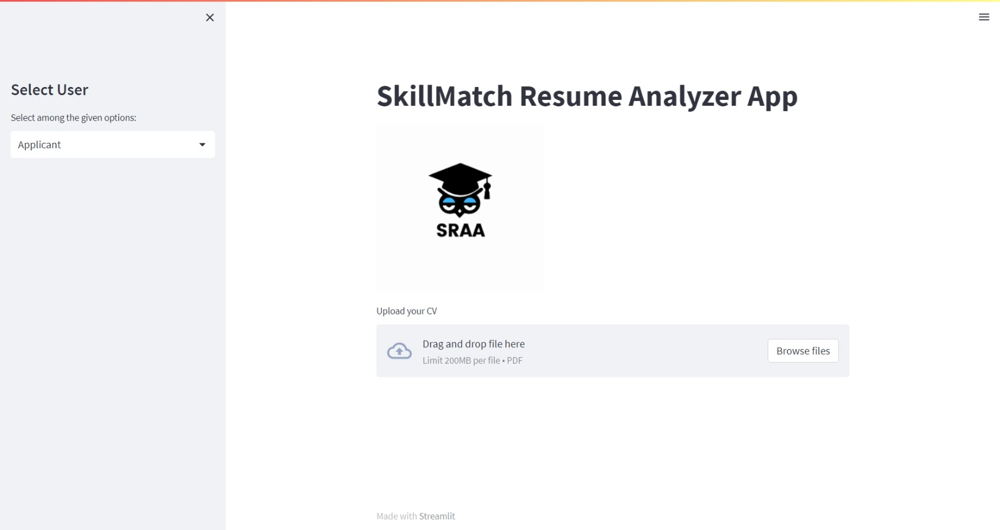
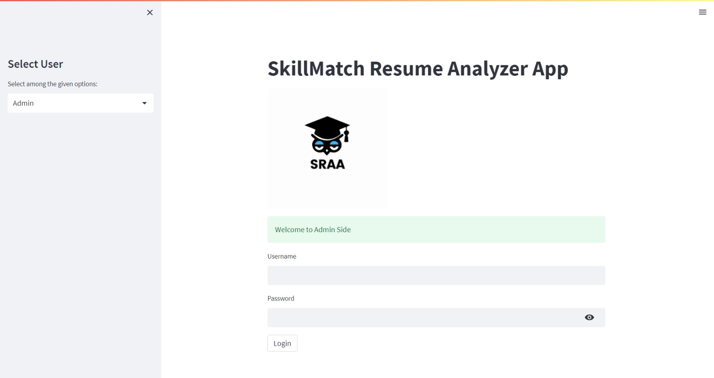

# SkillMatch

AI-powered resume analyzer. Final year dissertation project.


[](https://www.mysql.com/)
[](LICENSE)

---

## Overview

An intelligent system that uses NLP to parse resumes, score them against job requirements, and deliver actionable recommendations. Built to assist recruiters by automating the initial screening process.

---

## Features

- Resume upload and automatic text extraction
- NLP-based scoring against job requirements
- Skills gap analysis with recommendations
- Course and YouTube resource suggestions
- Job listing recommendations
- Career path guidance
- Admin panel with candidate overview and comparison

---

## Screenshots

| Applicant | Admin |
|-----------|-------|
|  |  |

---

## Setup

1. Clone the repository
   ```bash
   git clone https://github.com/elisharukovo/SkillMatch.git
   ```

2. Install requirements
   ```bash
   pip install -r requirements.txt
   ```

3. Start XAMPP (Apache and MySQL)

4. Run the Streamlit app
   ```bash
   streamlit run streamlit_app.py
   ```

Admin credentials:
```
username: raphaellG
password: admin@123
```

Uploaded resumes are stored in the `Uploaded_Resumes` folder. Course and video links are configured in `Courses.py`.

---

## Tech Stack

| Layer | Technology |
|-------|-----------|
| Frontend | Python, Streamlit |
| NLP | spaCy, pyresparser, pdfminer |
| Classifier | KNN |
| Database | MySQL |

---

## Roadmap

- Improved scoring with additional NLP models
- LinkedIn profile integration
- Mobile-friendly interface

---

## License

MIT
